# Interfaces-Inteligentes-P02

### 1. Crear una escena simple sobre la que probar diferentes configuraciones de objetos físicos en Unity. La escena debe tener un plano a modo de suelo, una esfera y un cubo.
  #### a) Ninguno de los objetos será físico.
  Como las físicas no se aplican sobre ninguno de los objetos, ninguno cae.
  
  #### b) La esfera tiene físicas, el cubo no.
  En este caso, el cubo tiene físicas por lo cae encima de la esfera sin causarle un movimiento.
  
  #### c) La esfera y el cubo tienen físicas.
  En este caso, al caer el cubo, se mueve la esfera por la fuerza que ejerce.
  
  #### d) La esfera y el cubo son físicos y la esfera tiene 10 veces la masa del cubo.
  Como la esfera tiene más masa que el cubo, en este caso, no es capaz de moverla al caer.
  
  #### f) La esfera tiene físicas y el cubo es de tipo IsTrigger.
  Esto causa el cubo sea traspasable pero se puede detectar la colisión producida. La esfera se queda en el interior del cubo.
  
  #### g) La esfera tiene físicas, el cubo es de tipo IsTrigger y tiene físicas.
  En este caso, al ser un objeto traspasable, el cubo atraviesa el suelo.
  
  #### h) La esfera y el cubo son físicos y la esfera tiene 10 veces la masa del cubo, se impide la rotación del cubo sobre el plano XZ.
  Al no permitir la rotación, el cubo se queda estático encima de la esfera y esta no se mueve.
  

### 2. Sobre la escena que has trabajado ubica un cubo que represente un personaje que vas a mover. Se debe implementar un script que haga de CharacterController. Cuando el jugador pulse las teclas de flecha (o aswd) el jugador se moverá en la dirección que estos ejes indican.
  #### a) Crear un script para el personaje que lo desplace por la pantalla, sin aplicar simulación física.
  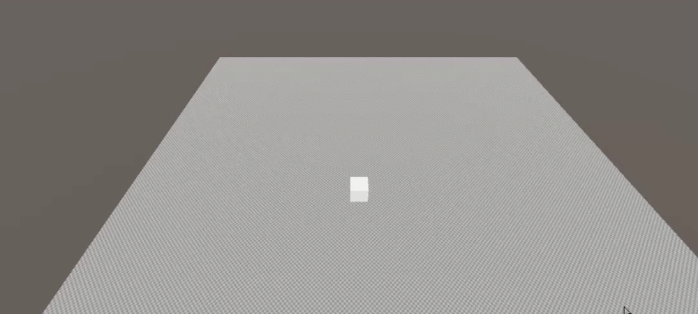
  #### b) Agregar un campo público que permita graduar la velocidad del movimiento desde el inspector de objetos.
  
  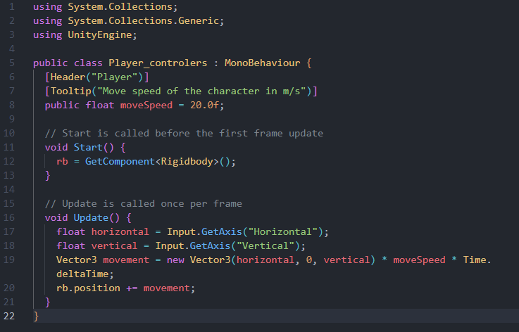
  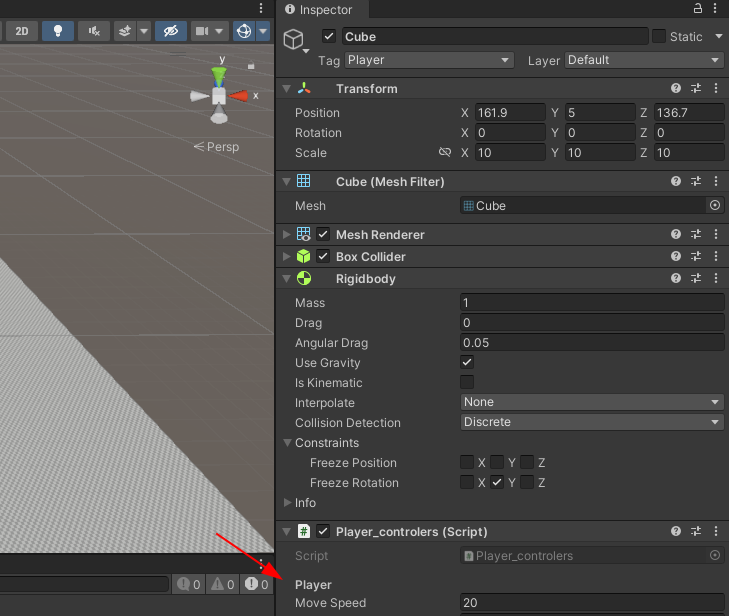
  #### c) Estar a la escucha de si el usuario ha utilizado los ejes virtuales. Elegir cuáles se va a permitir utilizar: flechas, awsd.
  Se pueden usar ambos controles por defecto.
  #### d) Elegir otros ejes virtuales para el giro y girar al jugador sobre el eje OY (up).
  Se ha implmentado el giro en las teclas Z y X.
  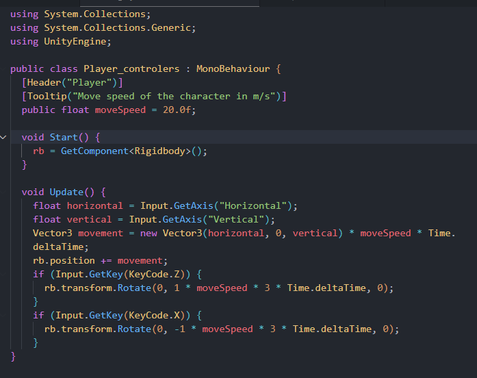
  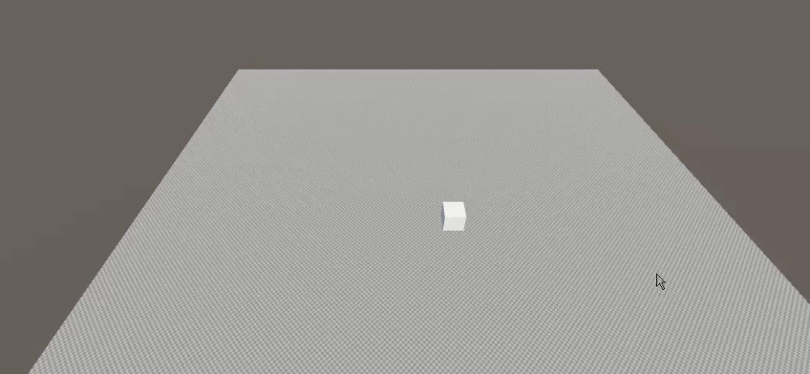

### 3. Sobre la escena que has trabajado programa los scripts necesarios para las siguientes acciones:
  #### a) Se deben incluir varios cilindros sobre la escena. Cada vez que el objeto jugador colisione con alguno de ellos, deben aumentar su tamaño y el jugador aumentar puntuación.
  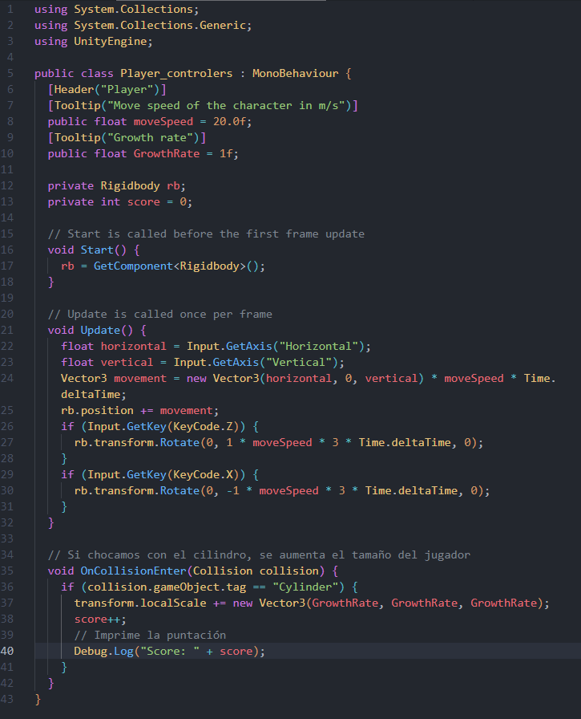
  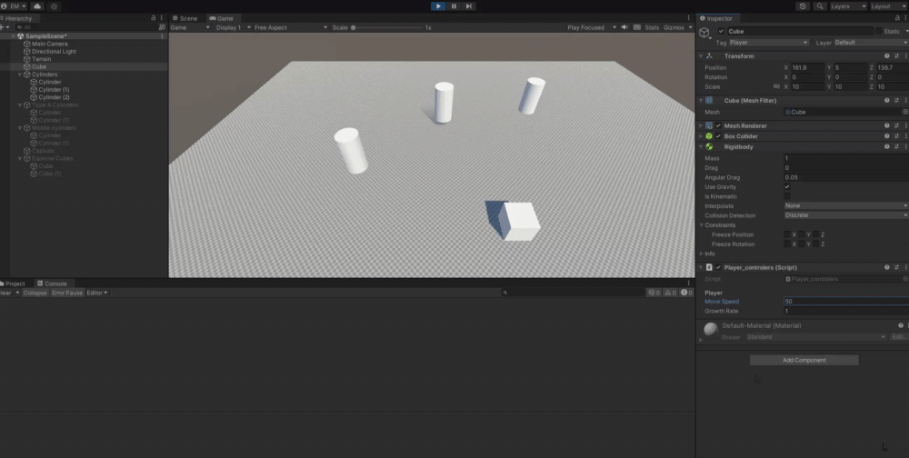
  #### b) Agregar cilindros de tipo A, en los que además, si el jugador pulsa la barra espaciadora lo mueve hacia fuera de él.
  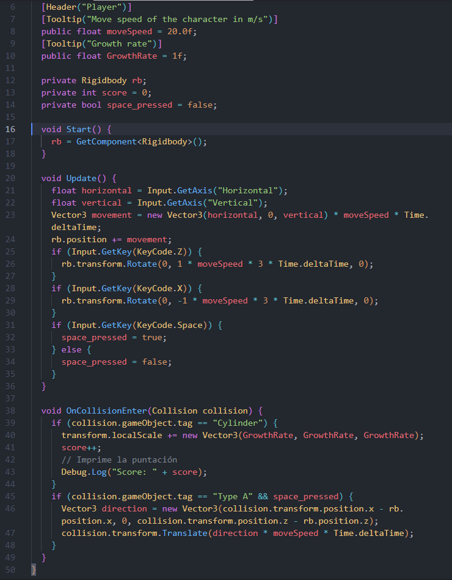
  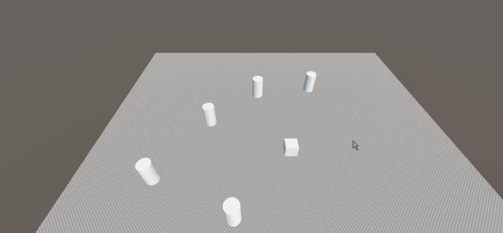
  #### c) Se deben incluir cilindros que se alejen del jugador cuando esté próximo.
  En este caso los he llamdo cilindros de tipo B.
  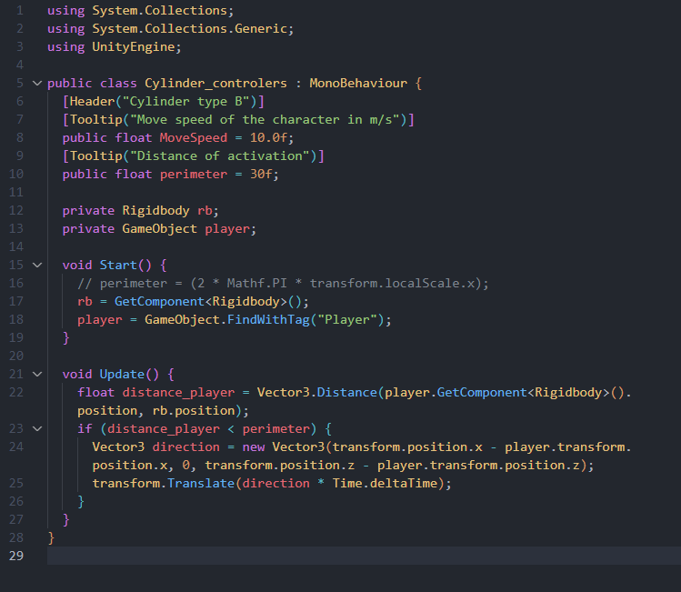
  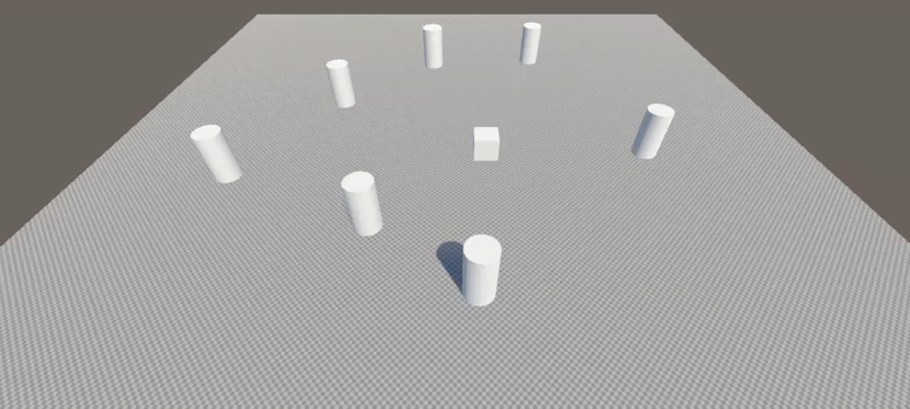
  #### d) Ubicar un tercer objeto que sea capaz de detectar colisiones y que se mueva con las teclas: I, L, J, M
  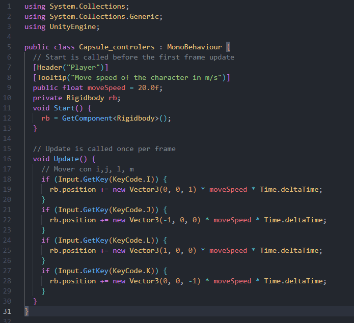
  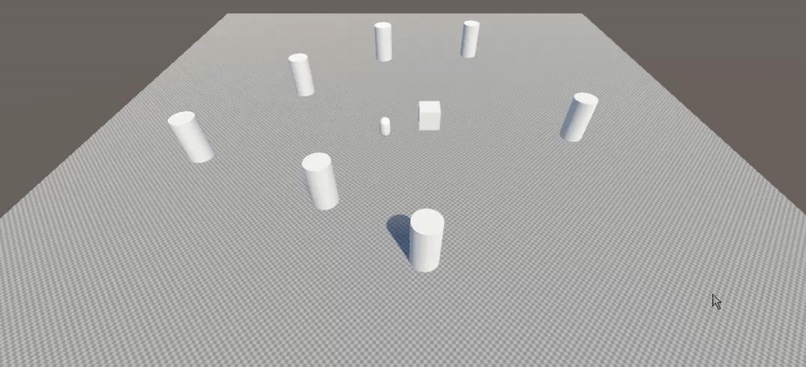
  #### e) Debes ubicar cubos que que aumentan de tamaño cuando se le acerca una esfera y que disminuye cuando se le acerca el jugador.
  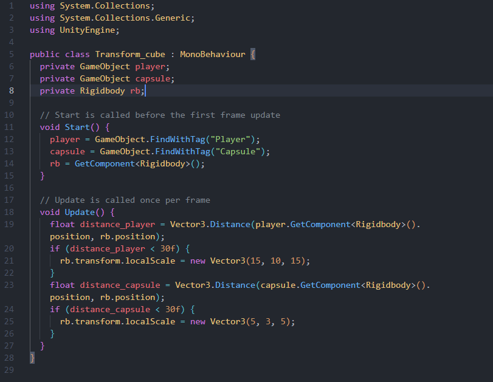
  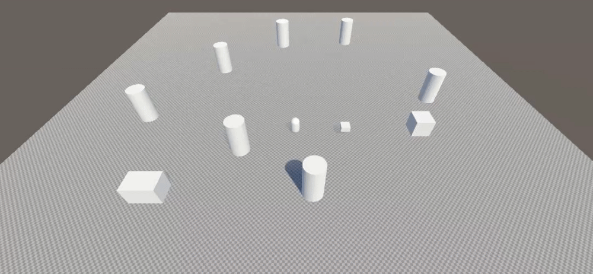
